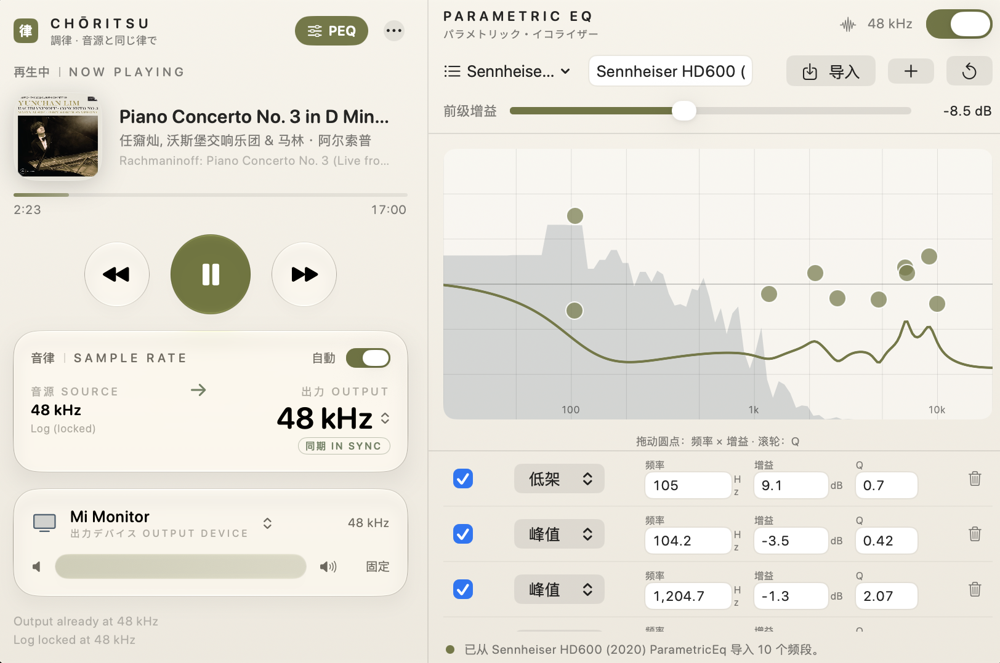
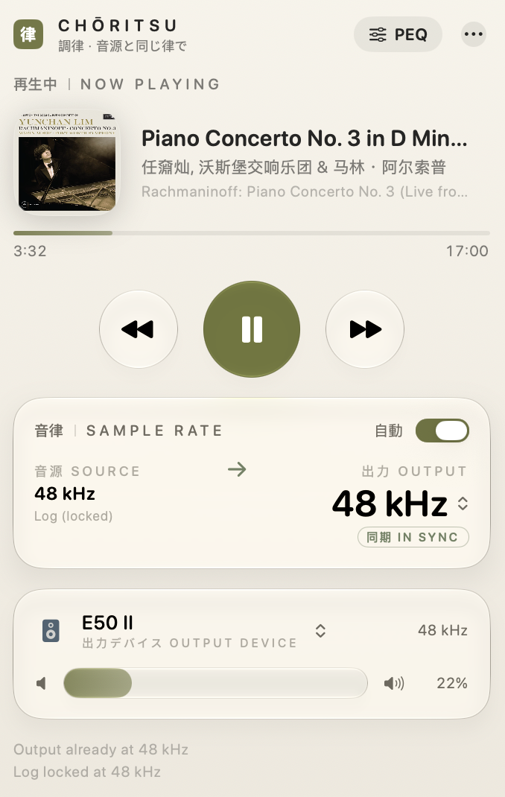
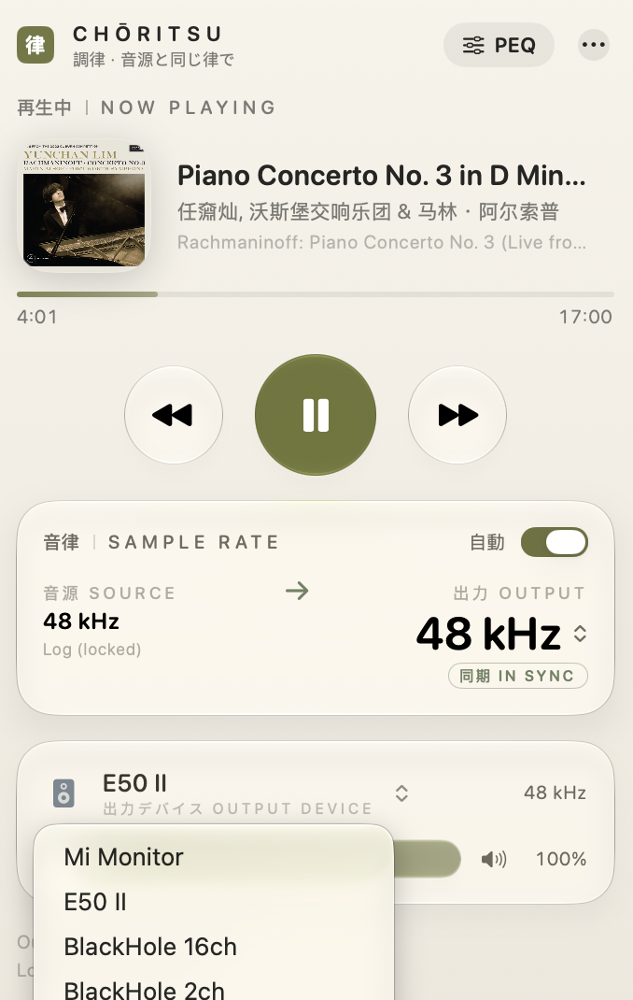
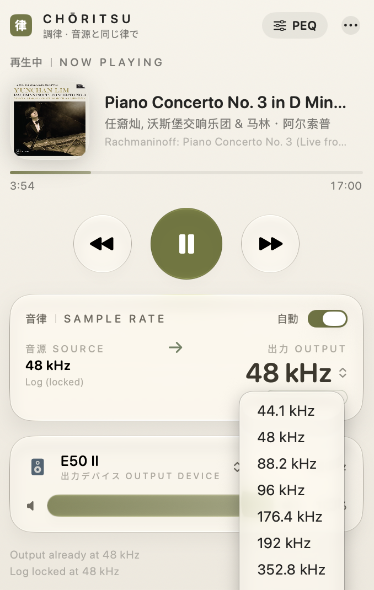
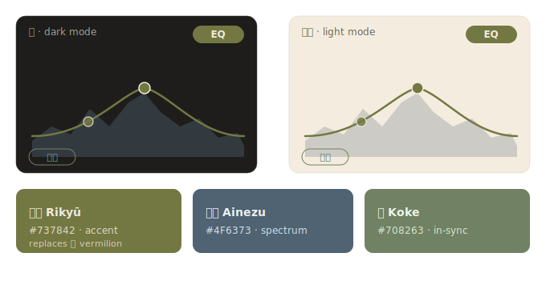

<p align="center">
  
</p>

<h1 align="center">Choritsu · 調律</h1>

<p align="center">
  Keep Apple Music bit-perfect, then tune your headphones to their target curve —<br>
  in one quiet, wabi-sabi panel.
</p>

<p align="center">
  
  
  
</p>

---

I built Choritsu for myself.

I listen to Apple Music, and I care about how my headphones and monitors actually sound — so I correct them with [AutoEQ](https://github.com/jaakkopasanen/AutoEq) target curves. Two things kept bothering me. macOS quietly resamples whenever the track's sample rate and the output device's rate disagree, so you lose bit-perfect playback without ever being told. And there was no *elegant* way to run a parametric EQ that simply follows the music — every option meant a virtual driver, an admin install, or leaving the player.

**調律** (*chōritsu*) is the Japanese word for tuning an instrument. This app does that for my listening chain: it keeps the output device locked to whatever Apple Music is really decoding — 44.1 up to 192 kHz, within a second of the track changing — and then, only if I ask, lays a multi-band parametric EQ on top so my HD600s and speakers land on their target curve. No kernel extension, no admin rights, nothing left running in the background.

It's a menu-bar app, and it tries to disappear into the desktop: washi paper, sumi ink, and a single 利休 green-gold accent.

## A look

<p align="center">
  
</p>

<p align="center">The EQ docks to the right of the main panel as one continuous popover.</p>

| Now playing | Output device | Source-matched rate |
|:---:|:---:|:---:|
|  |  |  |

## What it does

- **Follows the source sample rate** — matches the default output device to the current Apple Music track (44.1 / 48 / 88.2 / 96 / 176.4 / 192 kHz), debounced so it never flaps mid-track. The panel shows source → output, locked / estimating / unknown.
- **Headphone & speaker parametric EQ** — a multi-band PEQ applied to Apple Music through a *muted* Core Audio process tap (no driver, no admin rights). Import an AutoEQ `ParametricEQ.txt`, drag the response curve, scroll to set Q, watch the live spectrum, and keep a profile per pair of headphones. Opt-in, and clearly marked non-bit-perfect while active. EQ coefficients are recomputed on every rate change, so a correction stays correct from 44.1 to 192 kHz.
- **Now playing** — artwork, title, artist, album, and a live progress bar.
- **Transport** — play / pause, previous, next, from the menu bar.
- **Manual rate override** — every rate the device supports, like Audio MIDI Setup; picking a conflicting one bows out of auto-switch instead of fighting it.
- **Output device picker & volume** — switch the system default output and ride its hardware volume, all over Core Audio.
- **Native Liquid Glass UI** — real macOS 26 `glassEffect` materials, in a *wabi-sabi* palette.
- **Localized** — 調律 (Japanese / Traditional Chinese), 调律 (Simplified Chinese); the EQ panel is localized for ja / zh-Hans / zh-Hant.

## How it works

macOS never exposed a supported API for "the sample rate of the currently playing track", so Choritsu infers it and cross-checks three sources, in order of trust:

1. **Core Audio log stream** — `coreaudiod` logs the decoded format of the active stream; Choritsu tails the unified log, quantizes candidates to standard rates, and locks one only after weighted evidence accumulates. The lock resets when the track changes.
2. **MediaRemote** (private framework) — now-playing metadata. Restricted for third-party apps on recent macOS, so it is best-effort.
3. **AppleScript to Music.app** — the reliable fallback for metadata, playback state, artwork, and transport commands.

Device control (nominal sample rate, default device, volume) is plain Core Audio HAL property access — no kernel extensions, no audio drivers, nothing in the signal path. Choritsu only ever changes the same setting you could change in Audio MIDI Setup.

The **EQ** is the one part that touches audio, and only when you switch it on: it creates a *muted* Core Audio process tap on Apple Music (the macOS 14.4+ tap API) plus a private aggregate device, runs a biquad cascade at the device's current sample rate, and renders the result to your output device. Still no driver, still no admin rights. While it is active, playback is no longer bit-perfect — and the panel says so.

## The palette

<p align="center"></p>

The design language is *wabi-sabi* (侘寂): washi paper, sumi ink, a muted **利休** (Rikyū) green-gold accent, and a vermilion seal. The accent fills as the EQ comes alive; the spectrum behind the curve is a smoky **藍鼠** indigo; "in sync" glows a quiet **苔** moss.

## Requirements

- macOS 26 Tahoe or later (the UI is built on Liquid Glass `glassEffect` APIs)
- Apple Music app (subscription or local library)
- Xcode 26+ to build from source

## Build

```bash
git clone https://github.com/JC-kk/choritsu.git
cd choritsu
open SampleRateSwitcher.xcodeproj   # ⌘R to build & run
```

On first run, macOS asks to control **Music** (Automation) and to access **Media & Apple Music**. Turning on the EQ adds a one-time **audio recording** prompt (the process tap).

## Permissions

| Permission | Why |
|---|---|
| Automation → Music | Read the current track and artwork; play / pause / skip |
| Media & Apple Music | Now-playing metadata via MusicKit |
| Audio recording | The muted process tap that lets the EQ see Apple Music's output (only when EQ is on) |

No network access, no analytics, nothing leaves your machine.

## The name and the icon

The icon is the single kanji **律** — pitch, law, rhythm — set in mincho type on sumi ink, stamped with a vermilion seal, the way a calligrapher signs a finished work. In classical East Asian music theory the twelve-tone system is literally called 十二律, "the twelve ritsu". 調律 — "tuning" — is what a piano technician does, and what this app does to your output chain.

The icon ships as a hand-authored Icon Composer `.icon` bundle (`AppIcon.icon`), so the system renders it with real Liquid Glass layering. `branding/render_icon.swift` regenerates all bitmaps from code.

## Acknowledgements

- **[LosslessSwitcher](https://github.com/vincentneo/LosslessSwitcher)** by Vincent Neo — the project that proved automatic sample rate switching for Apple Music was possible, and the direct inspiration for Choritsu. If you are on an older macOS, go use it; it is excellent.
- **[AutoEQ](https://github.com/jaakkopasanen/AutoEq)** by Jaakko Pasanen — the headphone target-curve corrections Choritsu imports.
- [IconKit](https://github.com/rozd/icon-kit) — whose typed model of the `.icon` format documented what Apple has not.

## 中文简介

我是一个 Apple Music 用户，也是个 HiFi 玩家——平时用 [AutoEQ](https://github.com/jaakkopasanen/AutoEq) 的目标曲线校正耳机和音箱。一直有两件事让我别扭：当曲目采样率和输出设备不一致时，macOS 会悄悄重采样、丢掉 bit-perfect；而想给 Apple Music 上一个**跟随音源**的参数均衡，又总要装虚拟驱动、要管理员权限，不够优雅。

**调律**就是我给自己写的答案。它把默认输出设备锁定到 Apple Music 正在解码的真实采样率（44.1 到 192 kHz，换曲一秒内跟上），并且——只在你需要时——叠加一个多段**参数均衡器（PEQ）**，让耳机/音箱落到目标曲线上。

EQ 通过对 Apple Music 的**静音 process tap** 实现：无需驱动、无需管理员权限。支持导入 AutoEQ 预设、拖动响应曲线、滚轮调 Q、实时频谱、按耳机存档；切换采样率时系数会重算，所以校正在任何采样率下都正确（开启后即非 bit-perfect，面板会明确标注）。

界面是一个尽量隐入桌面的菜单栏面板——基于 macOS 26 原生 Liquid Glass 材质，设计语言为**侘寂**（wabi-sabi）：和纸、墨色、利休色（暗绿金）与朱印。需要 macOS 26+。

## License

[MIT](LICENSE)
