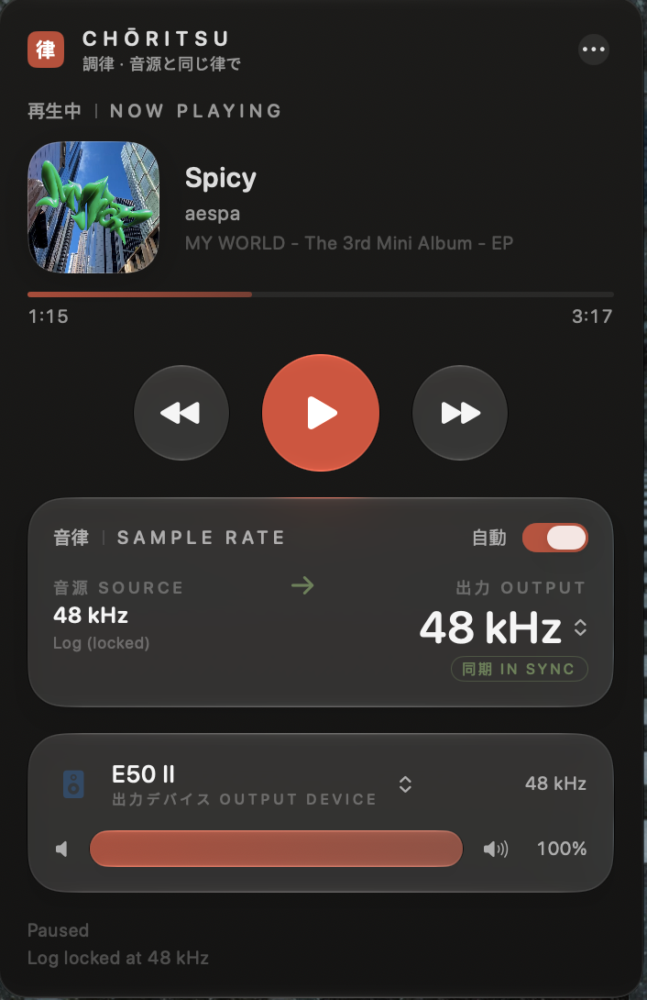
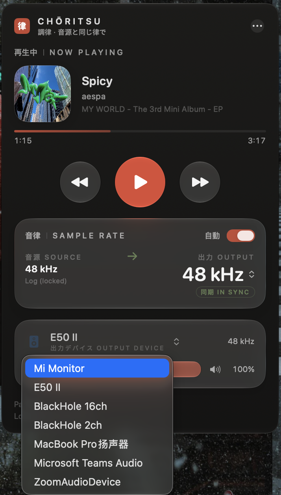
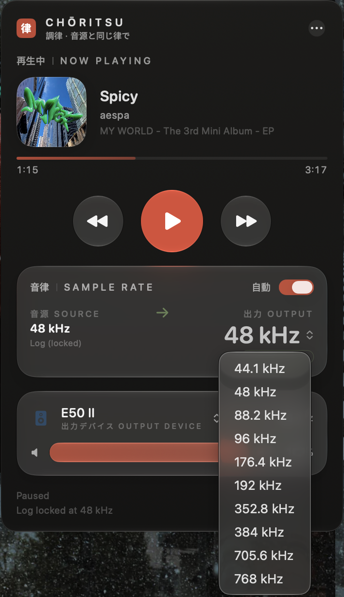

<p align="center">
  
</p>

<h1 align="center">Choritsu · 調律</h1>

<p align="center">
  Automatic sample rate switching for Apple Music on macOS —<br>
  wrapped in a Liquid Glass, Japanese-inspired control panel.
</p>

<p align="center">
  
  
  
</p>

---

**調律** (*chōritsu*) is Japanese for tuning an instrument. This app does exactly that for your DAC: when Apple Music plays a 96 kHz track into an output device stuck at 44.1 kHz (or the other way around), Core Audio silently resamples and you lose bit-perfect playback. Choritsu watches what Apple Music is actually decoding and retunes the output device's sample rate to match it — automatically, within a second of the track changing.

macOS never exposed a supported API for "the sample rate of the currently playing track", so Choritsu infers it the hard way and cross-checks several sources. The result is shown transparently in the panel (locked / estimating / unknown), and you can always override it by hand.

## Screenshots

| Now playing | Output device picker | Manual rate override |
|:---:|:---:|:---:|
|  |  |  |

## Features

- **Automatic sample rate switching** — matches the default output device to the current Apple Music track (44.1 / 48 / 88.2 / 96 / 176.4 / 192 kHz), with debouncing so it never flaps mid-track
- **Now playing panel** — artwork, title, artist, album, and a live progress bar
- **Transport controls** — play/pause, previous, next, right from the menu bar panel
- **Manual rate override** — a dropdown listing every rate the device supports, same as Audio MIDI Setup (picking a conflicting rate disengages auto-switch instead of fighting it)
- **Output device picker** — switch the system default output device from the panel
- **Volume control** — adjusts the output device's hardware volume via Core Audio
- **Native Liquid Glass UI** — every control uses the real macOS 26 `glassEffect` APIs; the design language is washi paper, sumi ink, and a vermilion seal
- Localized display name: 調律 (Japanese / Traditional Chinese), 调律 (Simplified Chinese)

## How it works

Three independent sources are merged, in order of trust:

1. **Core Audio log stream** — `coreaudiod` logs the decoded format of the active stream; Choritsu tails the unified log, quantizes candidate rates to standard values, and locks a rate only after weighted evidence accumulates (frames/duration-derived lines count extra). The lock resets when the track changes.
2. **MediaRemote** (private framework) — now-playing metadata: title, artist, album, artwork, elapsed/duration. On recent macOS releases this framework is restricted for third-party apps, so it is treated as best-effort.
3. **AppleScript to Music.app** — the reliable fallback for track metadata, playback state, and artwork, and the mechanism for transport commands.

Device control (nominal sample rate, default device, volume) is plain Core Audio HAL property access — no kernel extensions, no audio drivers, nothing in the signal path. Choritsu only ever changes the same setting you could change in Audio MIDI Setup.

## Requirements

- macOS 26 Tahoe or later (the UI is built on Liquid Glass `glassEffect` APIs)
- Apple Music app (the subscription service or local library playback)
- Xcode 26+ to build from source

## Build

```bash
git clone https://github.com/JC-kk/choritsu.git
cd choritsu
open SampleRateSwitcher.xcodeproj   # ⌘R to build & run
```

On first run, macOS will ask for permission to control **Music** (Automation) and to access **Media & Apple Music**. Both are required to read the current track and drive playback.

## Permissions

| Permission | Why |
|---|---|
| Automation → Music | Read current track metadata and artwork; play/pause/skip |
| Media & Apple Music | Now-playing metadata via MusicKit |

No network access, no analytics, nothing leaves your machine.

## The name and the icon

The icon is the single kanji **律** — pitch, law, rhythm — set in mincho type on sumi ink, stamped with a vermilion seal, the way a calligrapher signs a finished work. In classical East Asian music theory the twelve-tone system is literally called 十二律, "the twelve ritsu". 調律 — "tuning" — is what a piano technician does, and what this app does to your output device.

The icon ships as a hand-authored Icon Composer `.icon` bundle (`AppIcon.icon`), so the system renders it with real Liquid Glass layering. `branding/render_icon.swift` regenerates all bitmaps from code.

## Acknowledgements

- **[LosslessSwitcher](https://github.com/vincentneo/LosslessSwitcher)** by Vincent Neo — the project that proved automatic sample rate switching for Apple Music was possible, and the direct inspiration for Choritsu. If you are on an older macOS, go use it; it is excellent.
- [IconKit](https://github.com/rozd/icon-kit) — whose typed model of the `.icon` format documented what Apple has not.

## 中文简介

**调律**是一个 macOS 菜单栏应用：当 Apple Music 播放的曲目采样率与输出设备不一致时（比如 96 kHz 的无损曲目输出到锁在 44.1 kHz 的解码器上），Core Audio 会做有损的重采样。调律通过解析系统日志推断当前曲目的真实采样率，并自动把默认输出设备调整到一致，实现 bit-perfect 播放。

面板提供：播放信息与封面、播放控制、源/输出采样率对照（支持手动选择，与「音频 MIDI 设置」一致）、输出设备切换、设备音量调节。整个界面基于 macOS 26 原生 Liquid Glass 材质，设计语言取自和纸、墨色与朱印。

需要 macOS 26+。首次运行请在弹窗中允许对 Music 的自动化控制权限。

## License

[MIT](LICENSE)
